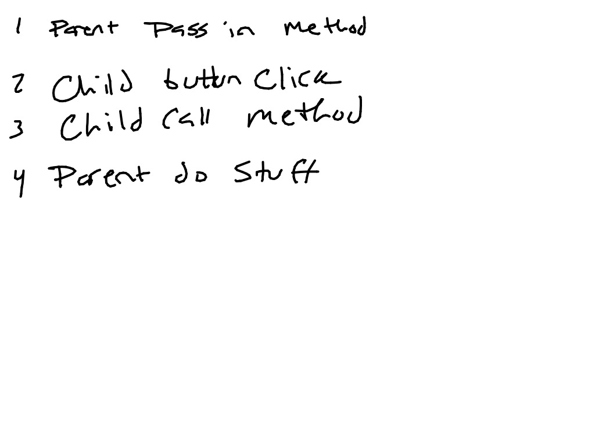

# Props Review with Jest

This app is the result of an in class demo of passing props in a React application.

## Live Coding
You can watch the complete lecture here:

## What happens when we pass a Method as a Prop

* This project was bootstrapped with [Create React App](https://github.com/facebook/create-react-app).
